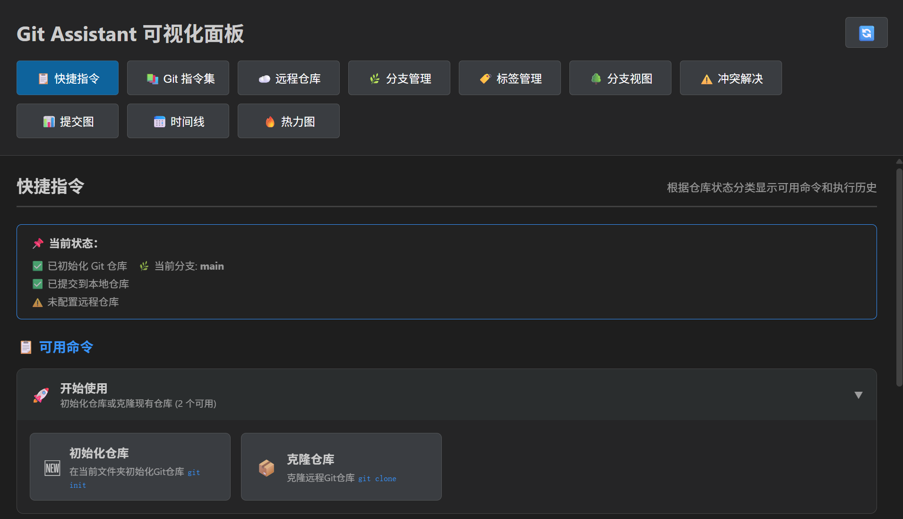
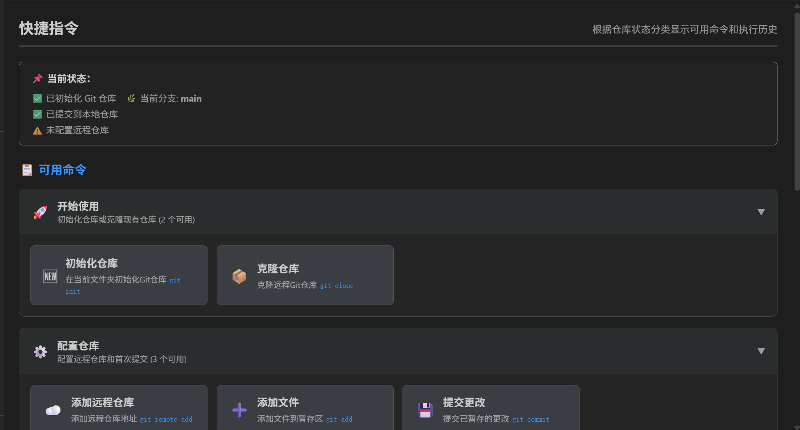
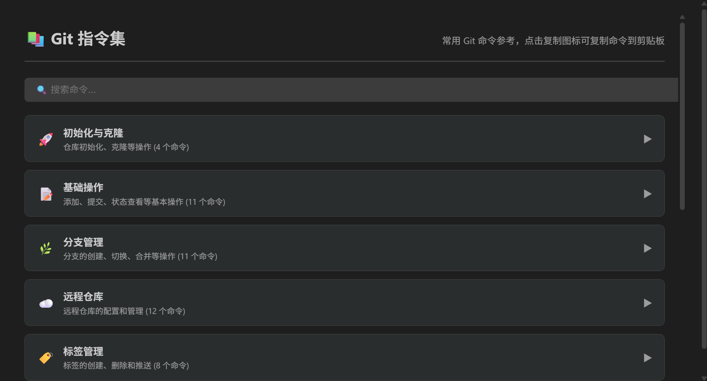
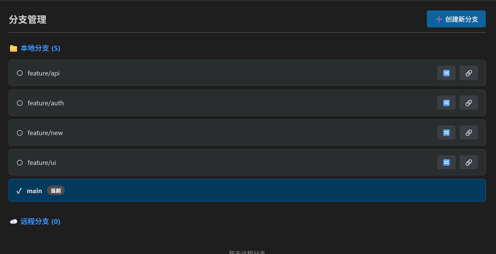
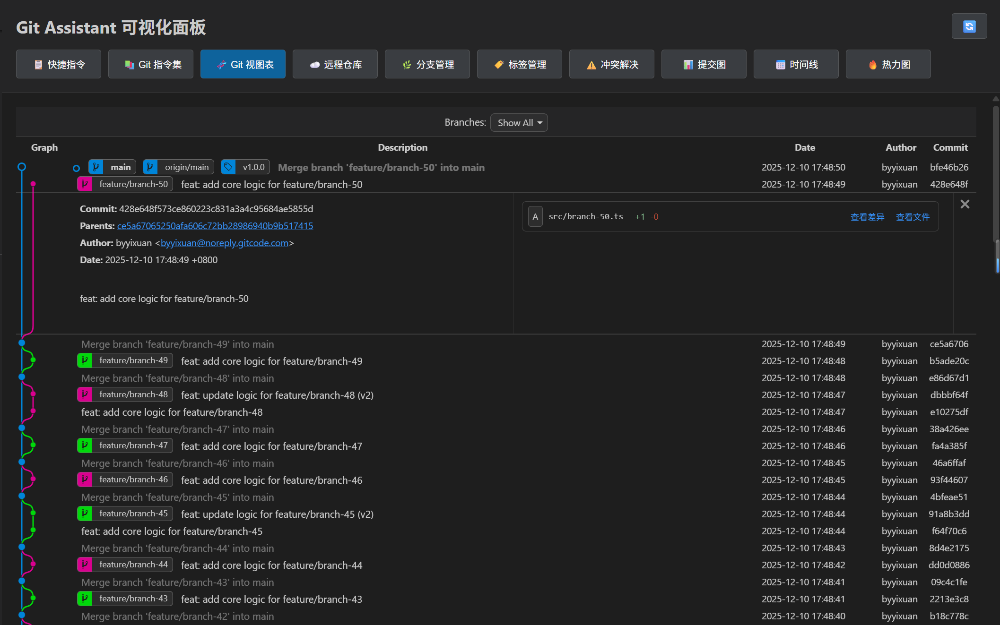
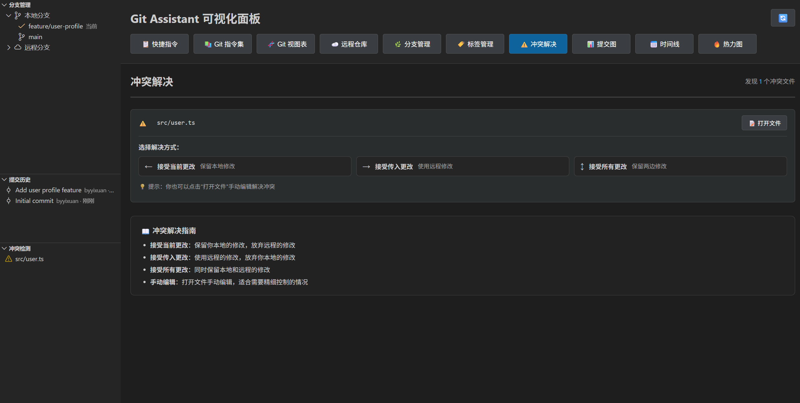
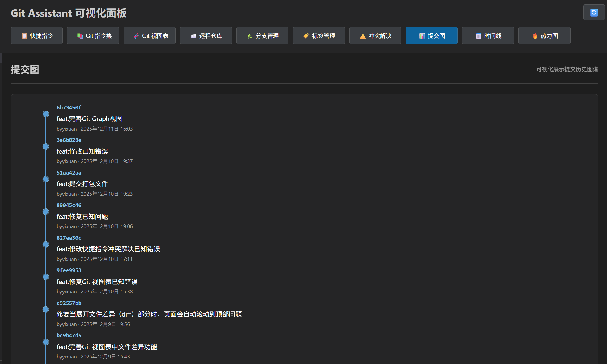
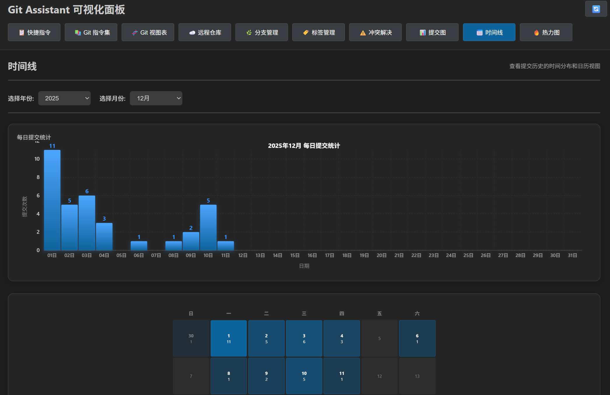
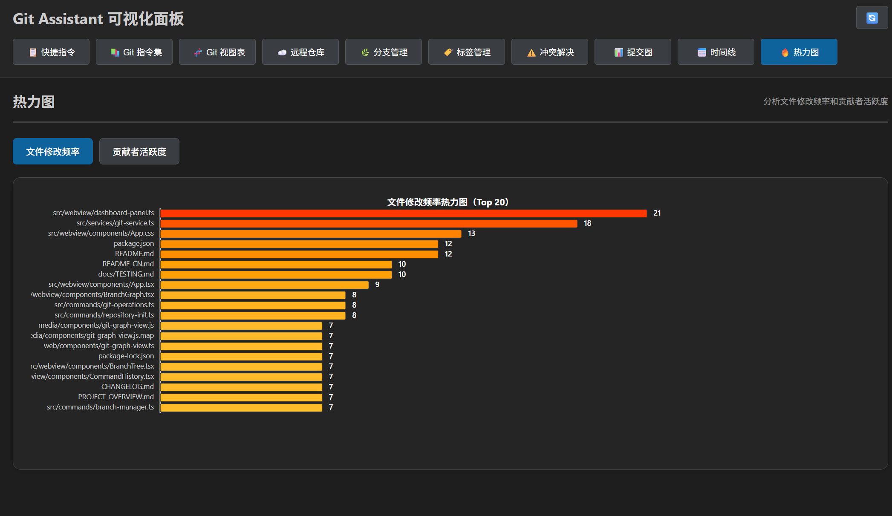

# Git Assistant - VS Code 增强版Git工具

<div align="center">


**强大的Git可视化管理工具，让Git操作更简单、更高效！**

[](https://github.com/YIXUAN-oss/CodeGitAssistant/releases/tag/v1.0.2)
[](LICENSE)
[](https://code.visualstudio.com/)

</div>

## 📌 项目速览

- **版本**：v1.0.2（VS Code 1.80+，Node.js 16+，Git 2.0+）
- **状态**：🟢 活跃开发中 · 最后一次更新 2025-12-03
- **核心能力**：快捷 Git 操作 · 可视化控制面板 · 分支/远程/标签管理 · 冲突检测
- **技术栈**：TypeScript + VS Code Extension API + 原生 DOM/Canvas/SVG 组件 + D3.js + simple-git
- **性能指标**：激活 < 500ms · 控制面板基础数据刷新 < 400ms · 大仓库统计数据 < 1.5s


## ✨ 演示视频

v1.0.2 演示视频:

https://go.plvideo.cn/front/video/view?vid=y87d9a2d3c23eaf798584107f7b65771_y

v1.0.0 演示视频：

http://go.plvideo.cn/front/video/view?vid=y87d9a2d3cf2fc80889781fae7d16a95_y


## ✨ 功能特性

### 🚀 快捷 Git 操作
- **一键推送/拉取**：`Ctrl+Alt+P/L` 直接触发 git push/pull，推送前可选确认，支持自动 stash 与进度提示
- **全流程初始化**：在空目录执行 `git init → git remote add → git add . → git commit → git push`，一步完成远程配置与首个提交
- **智能克隆**：可视化输入远程地址、选择目标目录并展示克隆进度，结束后自动打开工作区
- **暂存与提交向导**：`git-assistant.addFiles` 支持一键暂存或多选暂存，`git-assistant.commitChanges` 提供模板校验、进度条与错误回滚
- **命令前安全检查**：自动检测未保存文件、未提交改动、潜在冲突与当前分支状态，必要时提示 stash 或确认
- **操作日志**：所有命令均进入历史列表并附带状态、耗时与错误信息，便于复盘或重复执行

### 🌿 仓库/分支/标签/远程管理
- **分支树视图**：本地与远程分支分组展示，标记当前分支、合并状态及追踪关系，支持快速创建、切换、合并（含策略选择与自动 stash）
- **远程仓库面板**：`RemoteManager` 支持添加、重命名、更新 URL、删除远程，UI 内即可查看 fetch/push 地址并触发命令
- **标签管理**：`TagManager` 提供带注释/轻量标签创建、指定提交打标签、批量/单个推送、强制覆盖、删除本地/远程等能力，并实时跟踪执行结果
- **Git 视图表**：基于提交 DAG 的 Git 图形视图，展示分支关系与合流路径，辅助理解多分支协作
- **安全提示**：切换、合并、删除等高风险操作均带确认弹窗与可选策略，避免误操作

### 📊 可视化分析与控制面板
- **十个功能标签页**：快捷指令、Git 指令集、Git 视图表、远程仓库、分支管理、标签管理、冲突解决、提交图、时间线、热力图，面板内即可完成常见 Git 流程
- **2D 提交图谱**：D3.js 力导向图，高 DPI 字体渲染、自动换行、颜色增强和节点高光，专注分支关系分析
- **时间线与日历热力图**：统一 #0e639c 配色、紧凑布局、浅/深色主题自适应，即时洞察提交峰值与低谷
- **热力图分析**：展示文件修改频率与贡献者活跃度，快速发现热点文件与核心贡献者
- **命令历史/速查**：面板内查看最近命令、清空历史、复制命令、直接重跑；Git 指令集提供常用命令学习卡片

### ⚠️ 冲突检测与解决
- **实时监控**：TreeDataProvider 与文件监听协作，自动定位冲突文件并展示数量
- **三栏对比编辑器**：当前修改 / 传入修改 / 合并结果三列排布，可视化标记冲突块
- **智能建议**：提供接受当前、接受传入、接受全部以及手动编辑等方案，并支持撤销/重做
- **快捷入口**：控制面板直接跳转到冲突文件或触发 `git-assistant.resolveConflicts`

### 🧾 操作历史与通知
- **CommandHistory**：记录所有扩展命令、原生命令及面板动作，按功能分类，可一键复制或重试
- **状态栏提示**：左侧 StatusBar 图标展示扩展状态并提供面板入口
- **降级回执**：任何步骤失败都会回写到历史列表、通知中心与控制面板，保持 UI 一致

### ⚡ 性能与体验优化
- **Promise.allSettled 并行刷新**：状态、分支、日志、远程等数据同时抓取，大仓库下基础面板 <400ms 恢复
- **标签批量解析**：`git for-each-ref` 一次取回全部标签元数据，Tag Manager 打开速度提升 3-5 倍
- **前端快速回执**：Webview 先推送基础数据、再推送统计信息，避免长时间空白
- **容错与降级**：单个 Git 命令失败不会阻塞面板刷新，自动 fallback 至默认数据
- **文件监听优化**：只观察 `.git/HEAD` 与 `refs/heads/**`，配合 300ms 防抖，减少无谓刷新

## 🧭 控制面板标签

| 标签页 | 主要能力 |
|--------|----------|
| 📋 快捷指令 | 查看全部命令历史、复制/重试、清空记录 |
| 📚 Git 指令集 | 常用 Git 命令速查卡片与示例 |
| 🧬 Git 视图表 | Git 提交/分支关系与合并路径 |
| ☁️ 远程仓库 | 添加、重命名、更新 URL、删除远程 |
| 🌿 分支管理 | 分支树、创建/切换/合并、状态概览 |
| 🏷️ 标签管理 | 创建带注释/轻量标签、推送单个/全部、删除本地/远程 |
| ⚠️ 冲突解决 | 冲突列表、文件跳转、三栏对比编辑 |
| 📊 提交图 | 高 DPI 2D 提交图谱，展示分支与提交节点 |
| 📅 时间线 | 日历热力图 + 时间轴柱状图，洞察提交频率 |
| 🔥 热力图 | 文件修改频率与贡献者活跃度统计 |

> 标签顺序固定（每个按钮 120px），方便肌肉记忆与快速切换。

## 📦 安装

### 从 VS Code 市场安装
1. 打开VS Code
2. 按 `Ctrl+Shift+X` 打开扩展面板
3. 搜索 "Git Assistant - 增强版Git工具"
4. 点击"安装"

> 如果你已经下载了 `git-assistant-1.0.2.vsix`（例如从 GitHub Releases 或本仓库根目录），也可以在扩展视图右上角选择 **"从 VSIX 安装..."**，直接选择该文件完成安装。

### 从源码安装
```bash
# 克隆仓库
git clone https://github.com/YIXUAN-oss/CodeGitAssistant
cd CodeGitAssistant

# 安装依赖
npm install

# 编译扩展与前端资源（dist + media）
npm run compile

# 打包扩展 VSIX
npm run package
```

然后在 VS Code 中通过 `扩展：从 VSIX 安装...` 安装生成的 `.vsix` 文件。

## 🎯 快速开始

### 基础使用

1. **打开或初始化Git仓库**  
   - 已有仓库：直接打开包含 `.git` 的项目  
   - 空文件夹：按 `Ctrl+Shift+P` 执行 “Git Assistant: 初始化仓库”，跟随引导完成远程配置与初始提交

2. **查看侧边栏**  
   点击活动栏的Git Assistant图标，查看分支和历史

3. **使用快捷键**
   - `Ctrl+Alt+P` - 快速推送
   - `Ctrl+Alt+L` - 快速拉取
   - `Ctrl+Alt+B` - 切换分支

4. **打开控制面板**  
   按 `Ctrl+Shift+P` 输入 "Git Assistant: 打开控制面板"

5. **探索可视化功能**  
   在控制面板中切换不同标签页（按显示顺序）：
   - 📋 快捷指令 - 命令历史和快速执行
   - 📚 Git 指令集 - Git命令参考手册
   - 🌿 分支管理 - 分支树和操作（创建、切换、合并）
   - ☁️ 远程仓库 - 查看/管理 fetch & push 地址，添加/编辑/删除远程
   - 🏷️ 标签管理 - 创建带注释或轻量标签，推送/删除标签
   - 🧬 Git 视图表 - 分支关系与合流路径
   - ⚠️ 冲突解决 - 冲突检测和解决工具
   - 📊 提交图谱 - 2D图形化提交历史（高DPI优化）
   - 📅 时间线 - 提交时间线日历视图（浅色主题适配）
   - 🔥 热力图 - 文件修改和贡献者活跃度分析

### 命令列表

| 命令 | 快捷键 | 描述 |
|------|--------|------|
| Git Assistant: 快速推送 | `Ctrl+Alt+P` | 推送到远程仓库 |
| Git Assistant: 快速拉取 | `Ctrl+Alt+L` | 从远程拉取更新 |
| Git Assistant: 克隆仓库 | - | 克隆远程仓库 |
| Git Assistant: 初始化仓库 | - | 在当前文件夹执行 `git init` |
| Git Assistant: 添加远程仓库 | - | 输入地址并执行 `git remote add` |
| Git Assistant: 添加文件到暂存区 | - | 一键添加全部或多选文件 |
| Git Assistant: 提交更改 | - | 输入提交信息并推送到本地仓库 |
| Git Assistant: 创建分支 | - | 创建新分支（含命名校验） |
| Git Assistant: 切换分支 | `Ctrl+Alt+B` | 切换到其他分支并可选stash |
| Git Assistant: 合并分支 | - | 支持快进/三路合并策略 |
| Git Assistant: 查看提交历史 | - | 打开历史视图 |
| Git Assistant: 解决冲突 | - | 打开冲突解决器 |
| Git Assistant: 打开控制面板 | - | 启动可视化面板 |

## 📚 文档索引

- `PROJECT_OVERVIEW.md`：整体架构、模块拆解与技术选型
- `PROJECT_DETAILS.md`：详细技术文档、实现细节与创新点
- `GETTING_STARTED.md`：首次运行扩展与调试的详尽引导
- `ROADMAP.md`：产品路线图与未来功能规划
- `docs/QUICKSTART.md`：5 分钟动手体验与手动测试清单
- `docs/DEVELOPMENT.md`：目录说明、代码规范、工程实践
- `docs/TESTING.md`：自动化与手动测试策略、覆盖面要求
- `QUICK_REFERENCE.md`：快捷键、命令、面板操作速查卡
- `README_CN.md`：更详细的中文说明

## ⚙️ 配置选项

在VS Code设置中搜索 "Git Assistant" 或编辑 `settings.json`：

```json
{
  // 自动获取远程分支更新
  "git-assistant.autoFetch": true,

  // 推送前需要确认
  "git-assistant.confirmPush": true,

  // 历史记录显示数量
  "git-assistant.maxHistoryCount": 100,

  // 启用冲突高亮显示
  "git-assistant.conflictHighlight": true,

  // 快速推送/拉取时优先使用的远程（留空则自动选择）
  "git-assistant.defaultRemote": "origin"
}
```

## 🎨 界面预览

### 侧边展示


### 可视化面板



### 快捷指令



### Git 指令集



### 远程仓库


### 分支管理



### 标签管理


### Git 视图表



### 冲突解决



### 提交图



### 时间线



### 热力图




## 🏗️ 项目架构

```
git-assistant/
├── docs/                        # 开发/快速开始/测试文档
│   ├── DEVELOPMENT.md
│   ├── QUICKSTART.md
│   └── TESTING.md
├── dist/                        # 扩展主入口（extension.js）
├── media/                       # Webview 前端编译产物（由 web/ 编译而来）
├── resources/                   # 扩展图标与截图
├── src/
│   ├── extension.ts             # 扩展入口
│   ├── commands/
│   │   ├── index.ts             # 命令注册中心
│   │   ├── git-operations.ts    # Push/Pull/Clone
│   │   ├── branch-manager.ts    # 分支管理
│   │   ├── conflict-resolver.ts # 冲突解决
│   │   ├── repository-init.ts   # 初始化与远程配置
│   │   └── tag-manager.ts       # 标签管理
│   ├── providers/               # TreeDataProvider
│   │   ├── branch-provider.ts
│   │   ├── history-provider.ts
│   │   └── conflict-provider.ts
│   ├── services/
│   │   └── git-service.ts       # simple-git 封装
│   ├── types/
│   │   └── git.ts
│   ├── utils/
│   │   ├── command-history.ts
│   │   ├── constants.ts
│   │   ├── git-utils.ts
│   │   ├── logger.ts
│   │   ├── merge-history.ts
│   │   └── notification.ts
│   └── webview/
│       └── dashboard-panel.ts   # VS Code Webview 容器（负责加载 media/ 前端资源）
├── web/                         # Webview 前端源码（原生 TS + DOM/Canvas/SVG 组件）
│   ├── app.ts                   # 主应用 / 标签切换
│   ├── components/              # 10 个标签页对应的组件实现
│   ├── styles/                  # Webview 样式（通过脚本复制到 media/styles）
│   ├── types/
│   ├── utils/
│   ├── globals.d.ts
│   └── index.ts                 # Webview 入口
├── package.json
├── README.md
├── README_CN.md
├── tsconfig.json
├── tsconfig.web.json
└── webpack.config.js
```

## 🔄 数据流架构

```
用户操作
    ↓
Commands（命令层）      ←—— VS Code 命令/面板事件
    ↓
GitService（服务层）    ←—— simple-git 封装 / 错误处理
    ↓
simple-git / Git CLI
    ↓
Git 仓库
    ↓
Providers & Webview     ←—— TreeDataProvider / DashboardPanel
    ↓
VS Code UI（侧边栏 + 控制面板）
```

## 📈 性能指标

- **扩展激活**：< 500ms（按需注册命令与视图）
- **命令响应**：核心命令 < 100ms，长耗时操作带进度反馈
- **控制面板刷新**：基础数据 < 400ms；大仓库统计（热力图/时间线）< 1.5s
- **内存占用**：< 50MB；**包体积**：< 5MB
- **标签面板**：`git for-each-ref` 批量获取，加载提速 3-5 倍

## 🧰 技术栈 & 依赖

- **运行时依赖**：`simple-git`, `react` 18, `react-dom`, `d3`, `d3-force`, `three`, `@react-three/fiber`, `@react-three/drei`
- **开发依赖**：`typescript`, `webpack`, `ts-loader`, `eslint`, `@typescript-eslint/*`, `@types/*`, `@vscode/test-electron`
- **构建工具**：Webpack 5 + VS Code `vsce`，支持 `npm run watch/compile/package`
- **代码规范**：TypeScript 严格模式、ESLint、JSDoc 注释、命名约定（类 PascalCase、函数 camelCase、常量 UPPER_SNAKE_CASE）

## 🗺️ 路线图

### 版本规划

- **v1.1.0（规划中）**：AI 辅助冲突解决、协作工作流模板、插件化扩展点、自定义指令集、性能报表导出
- **v1.2.0（规划中）**：工作流模板系统、提交规范检查、交互式 Rebase 助手、智能冲突预防
- **v1.3.0（规划中）**：PR/MR 预览、提交前自动化检查、子模块管理、团队协作仪表板
- **v1.4.0+（规划中）**：多仓库管理、代码变更影响分析、智能回滚、性能优化等高级功能

> 📖 详细的路线图请查看 [ROADMAP.md](ROADMAP.md)

## 🔧 开发指南

### 环境要求
- Node.js 16+
- VS Code 1.80+
- Git 2.0+

### 开发流程

```bash
# 安装依赖
npm install

# 开发模式（监听文件变化）
npm run watch

# 编译
npm run compile

# 运行测试
npm test

# 代码检查
npm run lint

# 打包发布
npm run package
```

### 调试扩展

1. 在VS Code中打开项目
2. 按 `F5` 启动调试
3. 在新窗口中测试扩展功能

## 🧪 测试

### 运行测试

项目包含单元测试，覆盖核心工具函数和错误处理逻辑。

```bash
# 运行所有测试
npm test

# 编译测试文件
npm run compile-tests

# 监听模式运行测试
npm run watch-tests
```

### 测试覆盖

当前测试覆盖以下模块：
- ✅ `git-utils.ts` - Git 工具函数（分支名称格式化、冲突解析等）
- ✅ `error-handler.ts` - 统一错误处理
- 🔄 更多测试正在添加中...

### 测试结构

```
src/test/
├── suite/
│   ├── git-utils.test.ts          # Git 工具函数测试
│   ├── git-utils-conflict.test.ts # 冲突处理测试
│   ├── error-handler.test.ts      # 错误处理测试
│   └── index.ts                   # 测试入口
└── runTest.ts                     # 测试运行器
```

## 🤝 贡献指南

欢迎贡献代码、报告问题或提出建议！

1. Fork 本仓库
2. 创建特性分支 (`git checkout -b feature/AmazingFeature`)
3. 提交更改 (`git commit -m 'Add some AmazingFeature'`)
4. 推送到分支 (`git push origin feature/AmazingFeature`)
5. 开启Pull Request

### 开发规范

- 代码风格：遵循 ESLint 配置
- 提交信息：使用约定式提交格式（如 `feat:`, `fix:`, `docs:` 等）
- 测试：新功能需要添加相应的测试用例
- 文档：更新相关文档（README、JSDoc 等）

## 📝 更新日志

### v1.0.2 (2025-12-11)
- 🐛 修复部分场景下 Git 图视图当前提交指示器状态闪烁与不稳定问题
- 🐛 修复提交详情视图在按需加载提交信息时的滚动跳动问题
- ✨ 为旧提交按需补全提交详情（消息、作者等），避免大仓库初次加载过慢
- 📚 文档与版本号同步至 1.0.2，VSIX 文件名与发布说明统一

### v1.0.1 (2025-12-03)
- 🗂️ README/README_CN/PROJECT_OVERVIEW/PROJECT_DETAILS/QUICK_REFERENCE 等文档全面同步最新目录结构与数据流
- ⚙️ 配置说明补充 `git-assistant.defaultRemote`，快速推送/拉取可记忆默认远程
- 🧭 控制面板与命令列表文案对齐当前 10 个标签页和 QuickPick 快捷操作
- 📦 VSIX、发布脚本、测试用标签/示例文件命名更新为 1.0.1

### v1.0.0 (2025-11-26)
- 🎉 初代正式版发布
- ✨ 实现基础 Git 操作（Push/Pull/Clone/Add/Commit）
- 🚀 仓库初始化向导（一站式 init → push）
- 🌿 分支可视化管理（创建/切换/合并）
- ☁️ 远程仓库管理（添加/重命名/更新/删除）
- 🏷️ 标签管理（创建/推送/删除，批量解析优化）
- 📊 2D 提交历史图谱（高 DPI、主题适配）
- 🔥 热力图分析（文件修改频率、贡献者活跃度）
- 🌳 分支视图
- 📅 时间线日历视图（浅色/深色主题自适应）
- ⚠️ 冲突检测与三栏对比解决
- 📋 快捷指令历史记录
- ⚡ 性能优化：Promise.allSettled 并行刷新、标签批量解析、容错降级

## 📄 许可证

本项目采用 MIT 许可证 - 查看 [LICENSE](LICENSE) 文件了解详情

## 🙏 致谢

- [simple-git](https://github.com/steveukx/git-js) - Git操作库
- [VS Code Extension API](https://code.visualstudio.com/api) - 扩展开发文档
- [React](https://react.dev/) - UI框架

## 📮 联系方式

- 问题反馈：[GitHub Issues](https://github.com/YIXUAN-oss/CodeGitAssistant/issues)
- 功能建议：[GitHub Discussions](https://github.com/YIXUAN-oss/CodeGitAssistant/discussions)
- 邮箱：byyi.xuan@outlook.com

---

<div align="center">

**如果这个项目对你有帮助，请给个⭐️！**

Made with ❤️ by Yixuan

</div>

